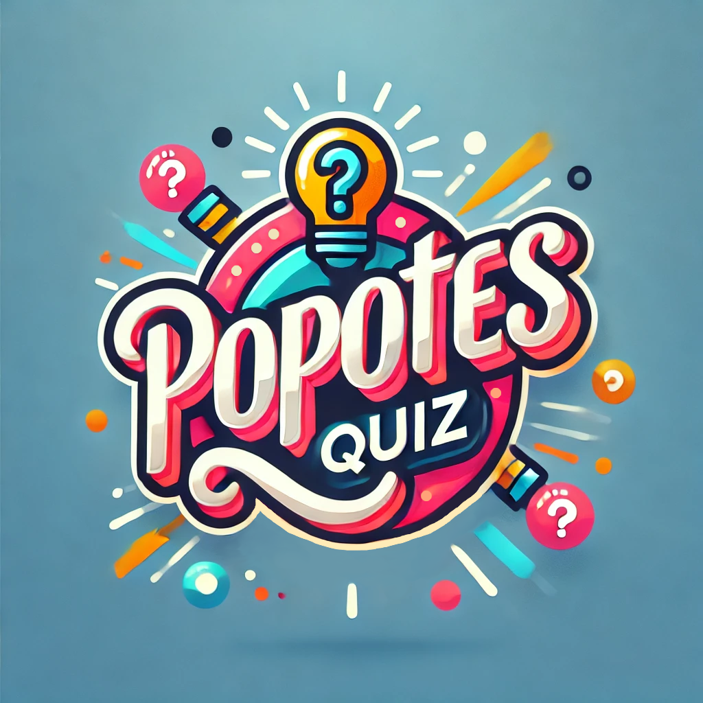
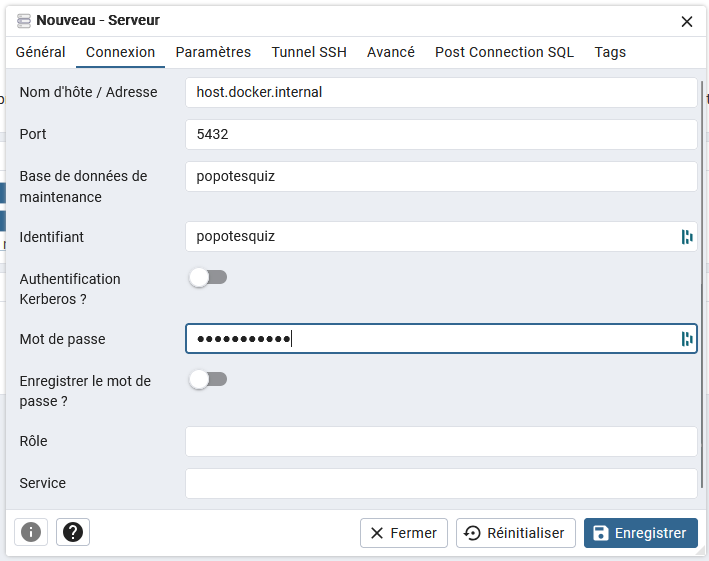

<p align="center">  
    
</p>

Bienvenue sur le dépôt principal du Popotes Quiz, notre glorieuse épreuve de culture générale annuelle. Loué soit le grand Quiz.

Ce dépôt ne contient que le nécessaire pour déployer le Quiz via Docker. Les dépôts de développement sont privés, je les garde jalousement. Comme diraient les mouettes dans Némo: "À moi".

Le Popotes Quiz fontionne avec 4 conteneurs:
- popotesquiz-bdd: la base de données, une simple base PostgreSQL. Elle contient les différents quizs créés.
- pgAdmin: contient une instance de pgAdmin, pour pouvoir gérer tranquillement la base de données depuis une jolie UI. J'aime bien les lignes de commande, mais c'est quand même plus sympa.
- popotesquiz-serveur: le serveur, en NodeJS, qui gère toute la logique du quiz. S'il y a un problème, c'est sans doute lui le fautif !
- popotesquiz-ui: la jolie interface pour jouer au quiz, développée en React-Redux. Là aussi, c'est quand même plus sympa.

Les conteneurs sont tous basés sur des images accessibles publiquement sur DockerHub. Le docker_compose se suffit à lui-même pour démarrer le quiz. Il suffit d'ajouter un fichier .env avec des identifiants et des mots de passe. Voici un template de .env:
```
# Identifiants base de données
POSTGRES_DB=popotesquiz
POSTGRES_USER=admin
POSTGRES_PASSWORD=admin
BDD_UTILISATEUR=popotesquiz
BDD_UTILISATEUR_MDP=popotesquiz

# Identifiant pgAdmin
PGADMIN_EMAIL=admin@admin.com
PGADMIN_MDP=admin
```

## Accéder à pgAdmin

En cas de besoin, pgAdmin est accessible sur le port 5050. Pour se connecter à la base de données du Popotes Quiz:



Note: Les informations sont à adapter aux identifiants définis dans le .env. 'host.docker.internal' n'est valable qu'avec Docker Desktop (Windows/MacOS), sur Linux il faut utiliser le nom du conteneur ("db").